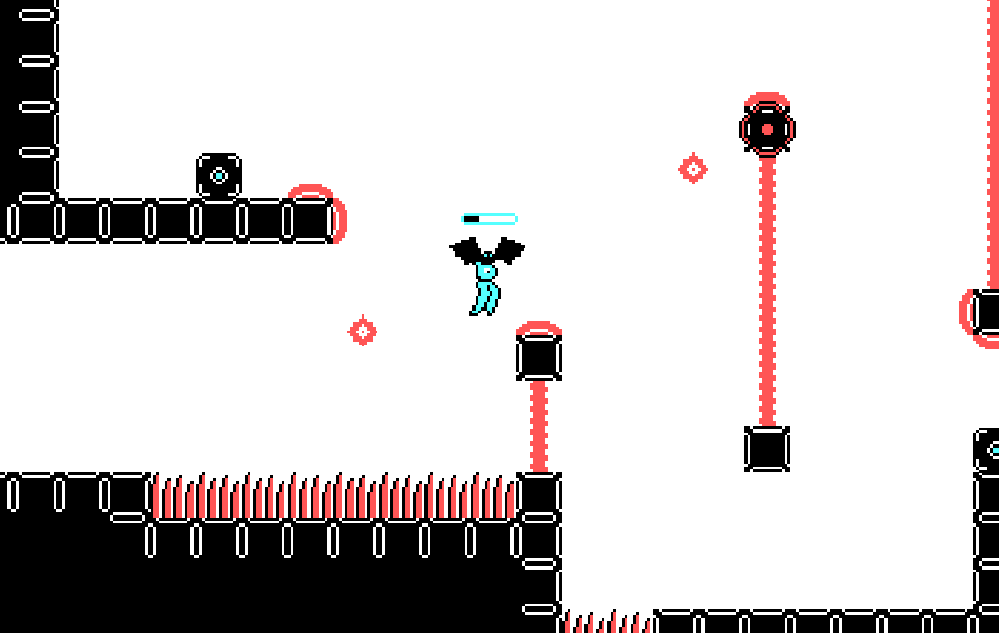

# Cary
a small game written in Rust

[Play or download on itch.io](https://specificprotagonist.itch.io/cary)

Your objective is to get Cary to the exit unharmed. This is hindered however
by a total lack of situational awarenes she displays. Luckily, you can pick
her - or the blue-marked blocks - up and fly them around, but your stamina
is limited and you are just as vulnerable as Cary.

Note: This was made for the Extra Credits game jam #6. 
Therefore, do not expect maintainable, sensible code! In particular,
the wgpu renderers lighting feature and some of the player control logic
are unneccessary, the commits not clean  and the physics are buggy.

This was made without a framework, but with hecs (ECS) and wgpu 
(cross-platform rendering). Because browser WebGPU support is still very
much experimental, WebGL is currently used for rendering on the web.
